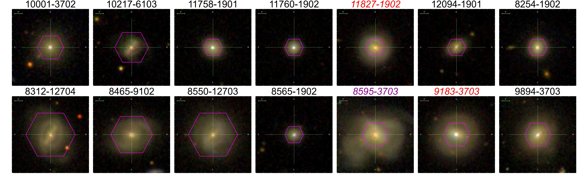
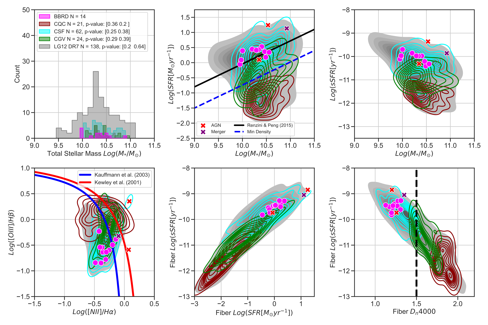
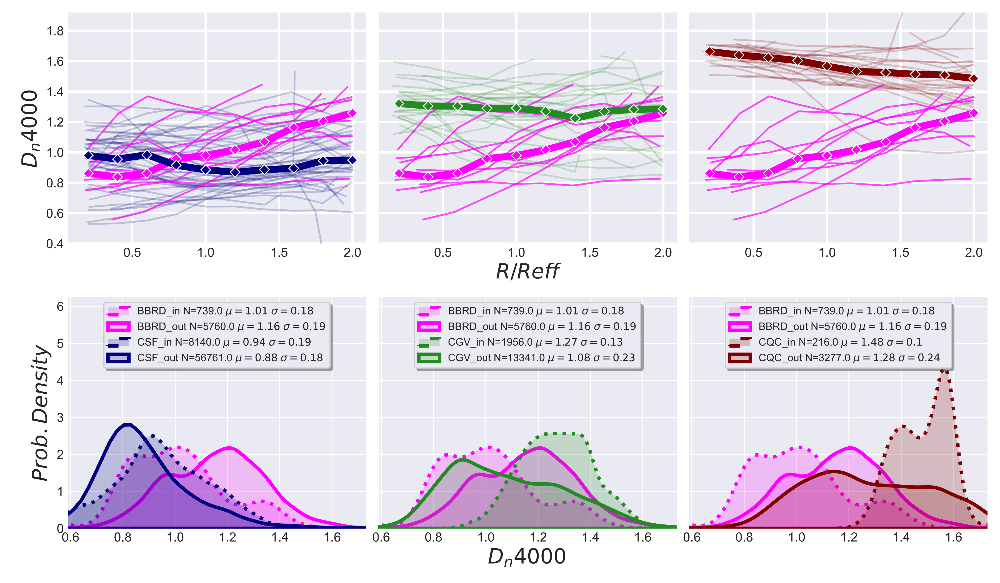
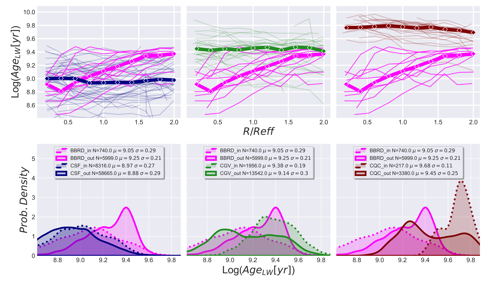

# breakBRD_radial_profiles_analysis

Codebase for creating and analyzing BreakBRD galaxies radial distribution profiles from the SDSS MaNGA survey

# M31 Red Giant Branch Stars Metallicity Distribution Function and Gradient

By Myles McKay(@mmckay18),

# Table of Contents

- [Introduction](#introduction)
- [Research Abstract](#research-abstract)
- [Data](#data) - [Data Sources](#data-sources) - [Data Acquisition](#data-acquisition) - [Data Preprocessing](#data-preprocessing)
- [Results and Evaluation](#results-and-evaluation)
  - [PHAT and PHAST RGB Spatial Metallicity Map](#phat-and-phast-rgb-spatial-metallicity-map)
  - [RGB Metallicity Distribution Function](#rgb-metallicity-distribution-function)
  - [RGB Metallicity Gradient](#rgb-metallicity-gradient)
- [Future Work](#future-work)
- [References](#references)
<!-- - [License](#license) -->

# Introduction

- This repository is made too show the complete workflow for analyzing the 14 distinct galaxies with intresting the star formation distrubiution using integral field unit spectrocopy from the MaNGA survey. I outline the exploratory data analysis, image processing, statistical analysis and data visualization.

# Research Abstract

The spatial distribution of stellar age properties provide key insights into the dynamic evolution of nearby galaxies. Using SDSS-IV MaNGA data, we investigate how the radial stellar age and mass profiles of 11 centrally-concentrated star-forming galaxies with photometrically red disks (Breaking Bulges in Red Disks; BreakBRDs) to examine for differences in the stellar age population distribution on sub-kpc scales. We aim to clarify if the BreakBRD galaxies central stellar population is indeed younger than the disk on the resolved scales and correspond to global measurements from previous literature. We compare the distribution plots to the control parent sample of galaxies with red bulges with photometrically red or blue disks. The parent sample is then separated into centrally star- forming, centrally green-valley and centrally quiescent galaxies based on Dn4000 index as a stellar age indicator. We find that the BreakBRD galaxies show a departure in the stellar age of the outer disk but a similar central stellar age to centrally star-forming galaxies, further indicating that the red outer disk is indeed older than the central region as seen in the global measurements. The mass distribution of the BreakBRD galaxies show no main deviation providing evidence that the mass distribution does not play a pivotal role in the recent central star formation and older disk age distribution.

# Data

## Data Sources

### Integral Field Unit Spectrocopy

- Mapping Nearby Galaxies at APO (MaNGA)[Description] - https://www.sdss4.org/surveys/manga/
  - https://data.sdss.org/sas/dr17/manga/spectro/analysis/v3_1_1/3.1.0/

### Value Added Catalog

- Pipe3D [Description] - https://data.sdss.org/datamodel/files/MANGA_PIPE3D/MANGADRP_VER/PIPE3D_VER/PLATE/manga.Pipe3D.cube.html#hdu1

  - https://data.sdss.org/sas/dr17/manga/spectro/pipe3d/v3_1_1/3.1.1/

<!-- ## Data Acquisition -->

## Data Preprocessing

1. **Sample Selection**: Galaxies were chosen from the SDSS-IV MaNGA survey, focusing on centrally star-forming galaxies with photometrically red disks (BreakBRD), using Dn4000 absorption index and g-r color cuts to identify relevant samples.

2. **Cross-Matching with MaNGA**: The selected galaxies were matched to MaNGA IFU spectroscopic observations, ensuring adequate radial coverage and spatial resolution, with observations processed through MaNGA's DRP and Pipe3D VAC pipelines for stellar and emission line data.

3. **AGN and Merger Removal**: Galaxies with central AGN ionization or significant structural disturbances from mergers were excluded using BPT diagrams and visual inspections, respectively, to ensure emission was dominated by star formation.

4. **Radial Profile Construction**: Radial profiles for each galaxy were created using elliptical coordinates and effective radii, binning spaxel data from the center to outer disk and plotting median values to analyze star formation and stellar population gradients.

5. **Stellar Mass and Age Maps**: Data products from Pipe3D were used to analyze stellar mass surface density and luminosity-weighted stellar ages, providing insights into the spatial distribution of stellar populations.

6. **Data Cleaning and Filtering**: Further quality checks included removing galaxies with low signal-to-noise spaxels, ensuring reliable data across radial profiles for subsequent analysis.

<!-- # Code Structure -->

# Results and Evaluation

Here's a continuation summarizing the results from your paper:

1. **Stellar Age Radial Distribution**:

   - The BreakBRD galaxies display an increasing Dn4000 index radial profile, suggesting a transition from a younger central stellar population to an older outer disk. This pattern is in contrast to the relatively flat profiles observed in centrally star-forming (CSF), centrally green valley (CGV), and centrally quiescent (CQC) control samples.
   - The luminosity-weighted stellar age profiles reinforce this trend, with BreakBRD galaxies showing younger stellar populations in the center compared to the disk, which aligns more closely with CGV galaxies. This indicates that BreakBRD galaxies may have experienced recent central star formation while the outer disk remains older.

2. **Stellar Mass Surface Density**:

   - The BreakBRD sample shows a monotonic decrease in stellar mass surface density from the center to the outskirts, consistent with inside-out mass growth. This trend is similar across all comparison samples, suggesting that mass assembly does not significantly influence the unique central star formation observed in BreakBRD galaxies.

3. **Comparison with Control Samples**:

   - Although BreakBRD galaxies have similar central stellar ages to CSF galaxies, their outer regions are noticeably older. The CGV and CQC samples exhibit more uniform stellar age distributions, supporting typical inside-out formation. The BreakBRD galaxies' distinct radial age gradient suggests potential mechanisms suppressing star formation in the outer disk.

4. **Implications for Galaxy Evolution**:
   - The results indicate that BreakBRD galaxies deviate from the inside-out formation model, likely due to mechanisms enhancing central star formation while suppressing it in the disk. This could be caused by factors such as gas inflows or environmental effects like ram-pressure stripping, but the exact mechanism remains uncertain.

These findings support the hypothesis that BreakBRD galaxies represent a unique case in galaxy evolution, characterized by centrally concentrated recent star formation and an older, potentially suppressed outer disk.

## Visualizations

<!-- ### Statistical Analysis -->

  
  
 
    SDSS color images of the <b>14 BreakBRD galaxies</b> observed by the MaNGA survey. The purple hexagon represents MaNGA FOV, and the images are titled with the unique plateifu identifier. The red labeled titles are the AGNs (11827-1902 and 9183-3703), and the purple label is the possible merger (8595-3703). These three galaxies are excluded from further analysis
  

  
  
 
     Global measurements from SDSS DR7 catalog for BreakBRD (BBRD) [magenta], LG12 centrally star-forming (CSF) [cyan], centrally green valley (CGV) [green] and centrally quiescent(CQC) [dark-red] sub-sample and the entire LG12 sample from the SDSS MaNGA sample. The red and purple [X] are the AGN/shock ionization dominated objects and a merger that we remove from further analysis. [Top left:] Total stellar mass histogram, with the legend listing the p-value from a two-sample Kolmogorov-Smirnov test between the BBRD and comparison sample. [Top center:] Global star-forming main-sequence where the black and blue line represent Renzini & Peng (2015) ridge-line and the minimum density line. [Top Right:] Total specific SFR (sSFR) vs Total stellar mass, [Bottom Right:] Baldwin et al. (1981) (BPT N [II]/Hα diagnostic, where red and blue line represent Kauffmann et al. (2003a) and Kewley et al. (2006)) classification fits. [Bottom Center:] 3” central fiber sSFR vs fiber SFR. [Bottom Left:] 3” central fiber sSFR vs fiber Dn4000. We show that the LG12 MaNGA sub-sample is well distributed across the original parent sample consisting of both high and low sSFR, similar to Tuttle & Tonnesen (2020) that can be used to separate the data into star-forming and quiescent populations for comparison to the BreakBRD sample.
  

  
  
 
    TopDn4000 index as a function of effective radial bin (radial profile). The individual lines are the profiles for each galaxy in the sample and the solid line is the frequency weighted median of the entire sample. Bottom probability density distribution of the inner (R < 0.5Ref f ) and outer (0.5Ref f < R < 2.0Ref f ) spaxels represented as dashed and solid lines respectively. From left to right, we show how the CSF(blue), CGV(green) and CQC(red) radial profiles compare to the BBRD (magenta) profiles. The BreakBRD galaxies shows a more pronounce incline than the CSF, CGV and CQC indicating that the stellar age evolution from the inner to outer radii is shifting from a younger to an older stellar population in contrast to inside-out formation. However, the CSF, CGV and CQC samples show a flat profile which also contrast to the inside-out declining stellar age distribution.
  

  
  
 
    The Luminosity-weighted Stellar Age Log(ΣSF R) as a function Ref f and Rellip following the same nomenclature and color scheme of Figure 3. The CSF and CQC samples reside at a younger stellar age and older ranges and show a flat R/Ref f radial profile on average and do not reflect that expected decreasing stellar age from inside-out formation. The BBRD sample is younger than the CQC sample at a given R/Ref f radii, indicating that there is possible continuous star formation across the galaxies. Additionally, the BBRD sample shows a noticeable increase in stellar age than the CSF in agreement central concentration of star formation and older redder disk in contrast to inside-out formation. The radial profiles in kpc show that the CQC sample has a decreasing radial profile consistent with what we expect from inside-out formation. However, the CSF consistently has a flat radial profile, indicating how younger stars could obscure the older stellar population in the center. The BBRD galaxies show a steep increase from the nuclei to 3 kpc and a relatively flat profile at larger radii. The bottom row of histograms further shows that the CSF and BBRD sample occupies a similar stellar age distribution, and the BBRD disk spaxels are in an intermediate range to the CSF and CQC galaxies. We assert that the BBRD galaxies deviate in the age profiles from CSF and CQC samples regardless of radial scale and show an increase to a flat stellar age radial profile. Recent gas inflow could induce the younger stellar age in the central region. The timescale for the gas to reach the outer disk is significantly longer, thus showing the disk to appear older. The older disk could also indicate signs of the suppression of star formation from outside-in quenching.
  

# Future Work

This work is in preparation for publication

# References

- Tuttle, S. E., & Tonnesen, S. 2020, The Astrophysical Journal, 889, 188. http://dx.doi.org/10.3847/1538-4357/ab5dbb

- Balogh, M. L., Morris, S. L., Yee, H. K. C., Carlberg, R. G., & Ellingson, E. 1999, ApJ, 527, 54
- Belfiore, F., Maiolino, R., Bundy, K., et al. 2018, MNRAS, 477, 3014
- Belfiore, F., Westfall, K. B., Schaefer, A., et al. 2019, AJ, 158, 160
- Bell, E. F., & de Jong, R. S. 2001, The Astrophysical Journal, 550, 212. https://doi.org/10.1086/319728
- Blanton, M. R., & Moustakas, J. 2009, Annual Review of Astronomy and Astrophysics, 47, 159–210. http://dx.doi.org/10.1146/annurev-astro-082708-101734
- Bluck, A. F. L., Maiolino, R., Piotrowska, J. M., et al. 2020, Monthly Notices of the Royal Astronomical Society, 499, 230–268. http://dx.doi.org/10.1093/mnras/staa2806
- Breda, I., Papaderos, P., Gomes, J. M., et al. 2020, A&A, 635, A177
- Brinchmann, J., Charlot, S., White, S. D. M., et al. 2004, MNRAS, 351, 1151
- Brook, C., Richard, S., Kawata, D., Martel, H., & Gibson, B. K. 2007, The Astrophysical Journal, 658, 60. https://doi.org/10.1086/511056
- Bruzual A., G. 1983, ApJ, 273, 105
- Bundy, K., Bershady, M. A., Law, D. R., et al. 2015, The Astrophysical Journal, 798, 7. https://doi.org/10.1088/0004-637x/798/1/7
- Calzetti, D. 2001, PASP, 113, 1449
- Cardelli, J. A., Clayton, G. C., & Mathis, J. S. 1989, ApJ, 345, 245
- Chen, G., Zhang, H.-X., Kong, X., et al. 2020, ApJ, 895, 146
- Dekel, A., Birnboim, Y., Engel, G., et al. 2009, Nature, 457, 451
- Drory, N., MacDonald, N., Bershady, M. A., et al. 2015, AJ, 149, 77
- Gallazzi, A., Charlot, S., Brinchmann, J., White, S. D. M., & Tremonti, C. A. 2005, MNRAS, 362, 41
- González Delgado, R. M., Pérez, E., Cid Fernandes, R., et al. 2014, A&A, 562, A47
- González Delgado, R. M., García-Benito, R., Pérez, E., et al. 2015, A&A, 581, A103
- Gunn, J. E., & Gott, J. Richard, I. 1972, ApJ, 176, 1
- Hilz, M., Naab, T., & Ostriker, J. P. 2013, MNRAS, 429, 2924
- Ibarra-Medel, H. J., Sánchez, S. F., Avila-Reese, V., et al. 2016, Monthly Notices of the Royal Astronomical Society, 463, 2799. https://doi.org/10.1093/mnras/stw2126
- Kauffmann, G., Heckman, T. M., White, S. D. M., et al. 2003a, MNRAS, 341, 33
- Kauffmann, G., Heckman, T. M., Tremonti, C., et al. 2003b, MNRAS, 346, 1055
- Kennicutt, Robert C., J. 1998, ARA&A, 36, 189
- Kennicutt, Robert C., J., Keel, W. C., & Blaha, C. A. 1989, AJ, 97, 1022
- Kepner, J. V. 1999, ApJ, 520, 59
- Kewley, L. J., Groves, B., Kauffmann, G., & Heckman, T. 2006, Monthly Notices of the Royal Astronomical Society, 372, 961. https://doi.org/10.1111/j.1365-2966.2006.10859.x
- Kroupa, P. 2001, MNRAS, 322, 231
- Lackner, C. N., & Gunn, J. E. 2012, Monthly Notices of the Royal Astronomical Society, 428, 2141. https://doi.org/10.1093/mnras/sts179
- Law, D. R., Cherinka, B., Yan, R., et al. 2016, AJ, 152, 83
- López Fernández, R., González Delgado, R. M., Pérez, E., et al. 2018, A&A, 615, A27
- Mo, H. J., Mao, S., & White, S. D. M. 1998, MNRAS, 295, 319
- Nelson, E. J., van Dokkum, P. G., Förster Schreiber, N. M., et al. 2016, The Astrophysical Journal, 828, 27. http://dx.doi.org/10.3847/0004-637X/828/1/27
- Pagel, B. E. J., & Edmunds, M. G. 1981, ARA&A, 19, 77
- Pan, Z., Li, J., Lin, W., et al. 2015, ApJL, 804, L42
- Parikh, T., Thomas, D., Maraston, C., et al. 2021, MNRAS, 502, 5508
- Peletier, R. F., & Valentijn, E. A. 1989, Ap&SS, 156, 127
- Pérez, E., Cid Fernandes, R., González Delgado, R. M., et al. 2013, ApJL, 764, L1
- Renzini, A., & Peng, Y.-j. 2015, ApJL, 801, L29
- Salim, S., Rich, R. M., Charlot, S., et al. 2007, ApJS, 173, 267
- Sánchez, S. F., Pérez, E., Sánchez-Blázquez, P., et al. 2016a, RMxAA, 52, 21
- Sánchez, S. F., Pérez, E., Sánchez-Blázquez, P., et al. 2016b, RMxAA, 52, 171
- Schmidt, M. 1959, The Astrophysical Journal, 129, 243
- Sánchez, S. F. 2020, Annual Review of Astronomy and Astrophysics, 58, 99–155. http://dx.doi.org/10.1146/annurev-astro-012120-013326
- Sánchez, S. F., Pérez, E., Sánchez-Blázquez, P., et al. 2015, Pipe3D, a pipeline to analyze Integral Field Spectroscopy data: I. New fitting philosophy of FIT3D, arXiv:1509.08552
- Urrutia, T., Wisotzki, L., Kerutt, J., et al. 2019, A&A, 624, A141
- Wake, D. A., Bundy, K., Diamond-Stanic, A. M., et al. 2017, AJ, 154, 86
- Westfall, K. B., Cappellari, M., Bershady, M. A., et al. 2019, AJ, 158, 231
